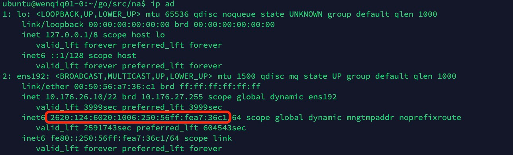
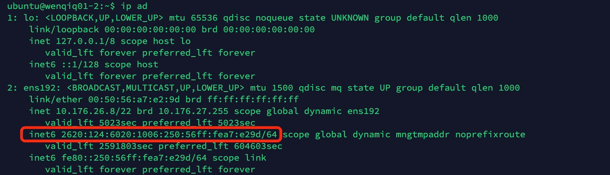
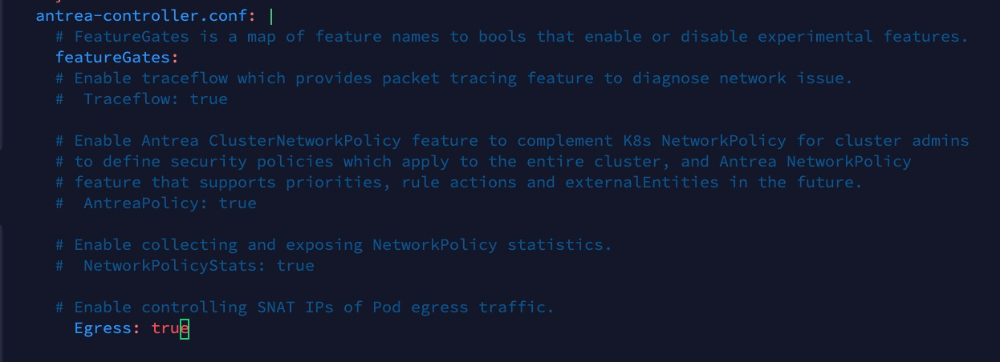
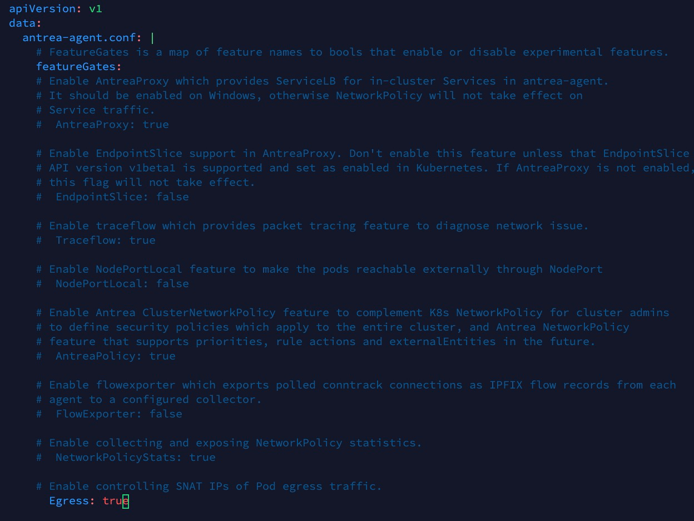
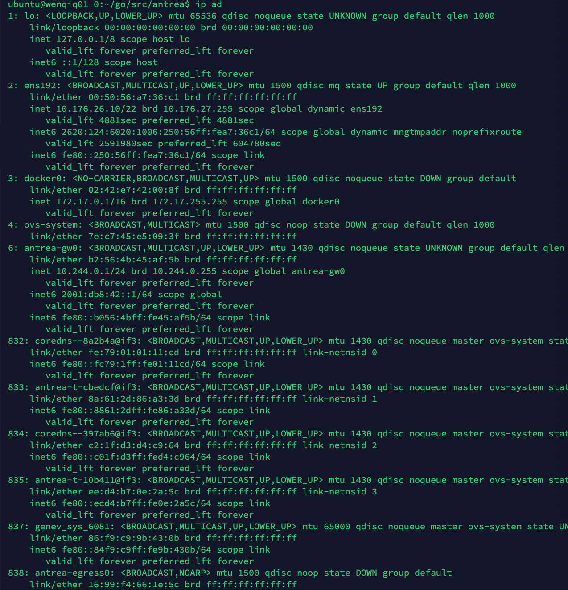
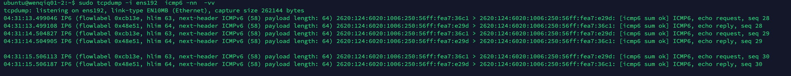
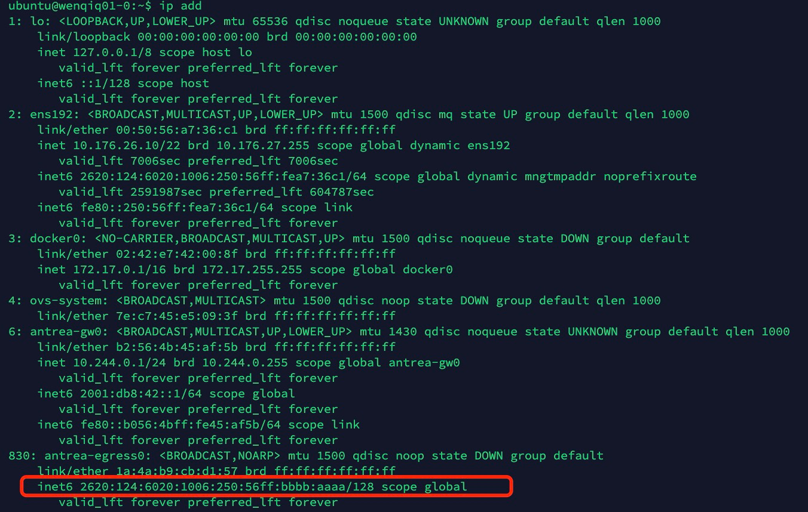
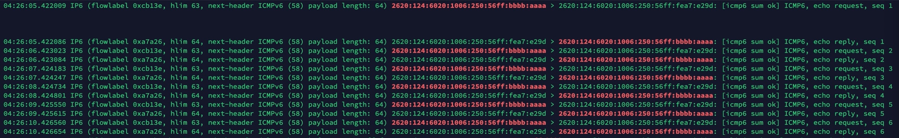

# 环境信息

## Node-master

### Name: wenqiq01-0

IPv6 Address: 2620:124:6020:1006:250:56ff:fea7:36c1



### Name: wenqiq01-2

IPv6 Address: 2620:124:6020:1006:250:56ff:fea7:e29d



## 创建Kubernetes集群(支持IPv6)

使用kubeadm.yml配置文件，在wenqiq01-0节点上创建K8s集群，单个节点
```
ubuntu@wenqiq01-0:~$ cat kubeadm.yml 
---
apiVersion: kubeadm.k8s.io/v1beta2
kind: ClusterConfiguration
featureGates:
  IPv6DualStack: true
networking:
  podSubnet: 10.244.0.0/16,2001:db8:42:0::/56
  serviceSubnet: 10.96.0.0/16,2001:db8:42:1::/112
---
apiVersion: kubeadm.k8s.io/v1beta2
kind: InitConfiguration
localAPIEndpoint:
  advertiseAddress: "10.176.26.10"
  bindPort: 6443
nodeRegistration:
  kubeletExtraArgs:
    node-ip: 10.176.26.10,2620:124:6020:1006:250:56ff:fea7:36c1
```

sudo kubeadm init --config=kubeadm.yml

```
ubuntu@wenqiq01-0:~$ sudo kubeadm init --config=kubeadm.yml
I0820 02:35:01.018133   11167 version.go:254] remote version is much newer: v1.22.1; falling back to: stable-1.21
[init] Using Kubernetes version: v1.21.4
[preflight] Running pre-flight checks
        [WARNING IsDockerSystemdCheck]: detected "cgroupfs" as the Docker cgroup driver. The recommended driver is "systemd". Please follow the guide at https://kubernetes.io/docs/setup/cri/
[preflight] Pulling images required for setting up a Kubernetes cluster
[preflight] This might take a minute or two, depending on the speed of your internet connection
[preflight] You can also perform this action in beforehand using 'kubeadm config images pull'
[certs] Using certificateDir folder "/etc/kubernetes/pki"
[certs] Generating "ca" certificate and key
[certs] Generating "apiserver" certificate and key
[certs] apiserver serving cert is signed for DNS names [kubernetes kubernetes.default kubernetes.default.svc kubernetes.default.svc.cluster.local wenqiq01-0] and IPs [10.96.0.1 10.176.26.10]
[certs] Generating "apiserver-kubelet-client" certificate and key
[certs] Generating "front-proxy-ca" certificate and key
[certs] Generating "front-proxy-client" certificate and key
[certs] Generating "etcd/ca" certificate and key
[certs] Generating "etcd/server" certificate and key
[certs] etcd/server serving cert is signed for DNS names [localhost wenqiq01-0] and IPs [10.176.26.10 127.0.0.1 ::1]
[certs] Generating "etcd/peer" certificate and key
[certs] etcd/peer serving cert is signed for DNS names [localhost wenqiq01-0] and IPs [10.176.26.10 127.0.0.1 ::1]
[certs] Generating "etcd/healthcheck-client" certificate and key
[certs] Generating "apiserver-etcd-client" certificate and key
[certs] Generating "sa" key and public key
[kubeconfig] Using kubeconfig folder "/etc/kubernetes"
[kubeconfig] Writing "admin.conf" kubeconfig file
[kubeconfig] Writing "kubelet.conf" kubeconfig file
[kubeconfig] Writing "controller-manager.conf" kubeconfig file
[kubeconfig] Writing "scheduler.conf" kubeconfig file
[kubelet-start] Writing kubelet environment file with flags to file "/var/lib/kubelet/kubeadm-flags.env"
[kubelet-start] Writing kubelet configuration to file "/var/lib/kubelet/config.yaml"
[kubelet-start] Starting the kubelet
[control-plane] Using manifest folder "/etc/kubernetes/manifests"
[control-plane] Creating static Pod manifest for "kube-apiserver"
[control-plane] Creating static Pod manifest for "kube-controller-manager"
[control-plane] Creating static Pod manifest for "kube-scheduler"
[etcd] Creating static Pod manifest for local etcd in "/etc/kubernetes/manifests"
[wait-control-plane] Waiting for the kubelet to boot up the control plane as static Pods from directory "/etc/kubernetes/manifests". This can take up to 4m0s
[kubelet-check] Initial timeout of 40s passed.
[apiclient] All control plane components are healthy after 76.503522 seconds
[upload-config] Storing the configuration used in ConfigMap "kubeadm-config" in the "kube-system" Namespace
[kubelet] Creating a ConfigMap "kubelet-config-1.21" in namespace kube-system with the configuration for the kubelets in the cluster
[upload-certs] Skipping phase. Please see --upload-certs
[mark-control-plane] Marking the node wenqiq01-0 as control-plane by adding the labels: [node-role.kubernetes.io/master(deprecated) node-role.kubernetes.io/control-plane node.kubernetes.io/exclude-from-external-load-balancers]
[mark-control-plane] Marking the node wenqiq01-0 as control-plane by adding the taints [node-role.kubernetes.io/master:NoSchedule]
[bootstrap-token] Using token: 6j0fw3.edkzae6zwfcf8u4p
[bootstrap-token] Configuring bootstrap tokens, cluster-info ConfigMap, RBAC Roles
[bootstrap-token] configured RBAC rules to allow Node Bootstrap tokens to get nodes
[bootstrap-token] configured RBAC rules to allow Node Bootstrap tokens to post CSRs in order for nodes to get long term certificate credentials
[bootstrap-token] configured RBAC rules to allow the csrapprover controller automatically approve CSRs from a Node Bootstrap Token
[bootstrap-token] configured RBAC rules to allow certificate rotation for all node client certificates in the cluster
[bootstrap-token] Creating the "cluster-info" ConfigMap in the "kube-public" namespace
[kubelet-finalize] Updating "/etc/kubernetes/kubelet.conf" to point to a rotatable kubelet client certificate and key
[addons] Applied essential addon: CoreDNS
[addons] Applied essential addon: kube-proxy

Your Kubernetes control-plane has initialized successfully!

To start using your cluster, you need to run the following as a regular user:

  mkdir -p $HOME/.kube
  sudo cp -i /etc/kubernetes/admin.conf $HOME/.kube/config
  sudo chown $(id -u):$(id -g) $HOME/.kube/config

Alternatively, if you are the root user, you can run:

  export KUBECONFIG=/etc/kubernetes/admin.conf

You should now deploy a pod network to the cluster.
Run "kubectl apply -f [podnetwork].yaml" with one of the options listed at:
  https://kubernetes.io/docs/concepts/cluster-administration/addons/

Then you can join any number of worker nodes by running the following on each as root:

kubeadm join 10.176.26.10:6443 --token xxxx
```

配置kubelet ipv6地址，重启kubelet

```
ubuntu@wenqiq01-0:~$ vi /etc/default/kubelet
ubuntu@wenqiq01-0:~$ cat /etc/default/kubelet
KUBELET_EXTRA_ARGS=--node-ip=10.176.26.10,2620:124:6020:1006:250:56ff:fea7:36c1
ubuntu@wenqiq01-0:~$ sudo systemctl restart kubelet
```

验证IPv6地址：

k get nodes wenqiq01-0  -o go-template --template='{{range .status.addresses}}{{printf "%s: %s\n" .type .address}}{{end}}'

```
ubuntu@wenqiq01-0:~$ k get nodes wenqiq01-0  -o go-template --template='{{range .status.addresses}}{{printf "%s: %s\n" .type .address}}{{end}}'
InternalIP: 10.176.26.10
InternalIP: 2620:124:6020:1006:250:56ff:fea7:36c1
```

get nodes:

```bash
ubuntu@wenqiq01-0:~$ k get nodes
NAME         STATUS   ROLES                  AGE    VERSION
wenqiq01-0   Ready    control-plane,master   135m   v1.21.0
```

## 创建Antrea, 打开Egress featureGate开关






k create -f build/yamls/antrea.yml

```json
ubuntu@wenqiq01-0:~/go/src/antrea$ k create -f build/yamls/antrea.yml 
customresourcedefinition.apiextensions.k8s.io/antreaagentinfos.clusterinformation.antrea.tanzu.vmware.com created
customresourcedefinition.apiextensions.k8s.io/antreaagentinfos.crd.antrea.io created
customresourcedefinition.apiextensions.k8s.io/antreacontrollerinfos.clusterinformation.antrea.tanzu.vmware.com created
customresourcedefinition.apiextensions.k8s.io/antreacontrollerinfos.crd.antrea.io created
customresourcedefinition.apiextensions.k8s.io/clustergroups.core.antrea.tanzu.vmware.com created
customresourcedefinition.apiextensions.k8s.io/clustergroups.crd.antrea.io created
customresourcedefinition.apiextensions.k8s.io/clusternetworkpolicies.crd.antrea.io created
customresourcedefinition.apiextensions.k8s.io/clusternetworkpolicies.security.antrea.tanzu.vmware.com created
customresourcedefinition.apiextensions.k8s.io/egresses.crd.antrea.io created
customresourcedefinition.apiextensions.k8s.io/externalentities.core.antrea.tanzu.vmware.com created
customresourcedefinition.apiextensions.k8s.io/externalentities.crd.antrea.io created
customresourcedefinition.apiextensions.k8s.io/externalippools.crd.antrea.io created
customresourcedefinition.apiextensions.k8s.io/networkpolicies.crd.antrea.io created
customresourcedefinition.apiextensions.k8s.io/networkpolicies.security.antrea.tanzu.vmware.com created
customresourcedefinition.apiextensions.k8s.io/tiers.crd.antrea.io created
customresourcedefinition.apiextensions.k8s.io/tiers.security.antrea.tanzu.vmware.com created
customresourcedefinition.apiextensions.k8s.io/traceflows.crd.antrea.io created
customresourcedefinition.apiextensions.k8s.io/traceflows.ops.antrea.tanzu.vmware.com created
serviceaccount/antctl created
serviceaccount/antrea-agent created
serviceaccount/antrea-controller created
clusterrole.rbac.authorization.k8s.io/aggregate-antrea-clustergroups-edit created
clusterrole.rbac.authorization.k8s.io/aggregate-antrea-clustergroups-view created
clusterrole.rbac.authorization.k8s.io/aggregate-antrea-policies-edit created
clusterrole.rbac.authorization.k8s.io/aggregate-antrea-policies-view created
clusterrole.rbac.authorization.k8s.io/aggregate-traceflows-edit created
clusterrole.rbac.authorization.k8s.io/aggregate-traceflows-view created
clusterrole.rbac.authorization.k8s.io/antctl created
clusterrole.rbac.authorization.k8s.io/antrea-agent created
clusterrole.rbac.authorization.k8s.io/antrea-cluster-identity-reader created
clusterrole.rbac.authorization.k8s.io/antrea-controller created
clusterrolebinding.rbac.authorization.k8s.io/antctl created
clusterrolebinding.rbac.authorization.k8s.io/antrea-agent created
clusterrolebinding.rbac.authorization.k8s.io/antrea-controller created
configmap/antrea-config-dd8ffc8tk9 created
service/antrea created
deployment.apps/antrea-controller created
apiservice.apiregistration.k8s.io/v1alpha1.stats.antrea.io created
apiservice.apiregistration.k8s.io/v1alpha1.stats.antrea.tanzu.vmware.com created
apiservice.apiregistration.k8s.io/v1beta1.system.antrea.io created
apiservice.apiregistration.k8s.io/v1beta1.system.antrea.tanzu.vmware.com created
apiservice.apiregistration.k8s.io/v1beta2.controlplane.antrea.io created
apiservice.apiregistration.k8s.io/v1beta2.controlplane.antrea.tanzu.vmware.com created
daemonset.apps/antrea-agent created
mutatingwebhookconfiguration.admissionregistration.k8s.io/crdmutator.antrea.io created
mutatingwebhookconfiguration.admissionregistration.k8s.io/crdmutator.antrea.tanzu.vmware.com created
validatingwebhookconfiguration.admissionregistration.k8s.io/crdvalidator.antrea.io created
validatingwebhookconfiguration.admissionregistration.k8s.io/crdvalidator.antrea.tanzu.vmware.com created
```

查看IP地址和接口，可以看到agent自动创建了antrea-egress0



## 创建测试Pod

```
k create ns antrea-test
k create deploy antrea-test-app --image=quay.io/valex/wpcustom:v1 --replicas=2 -n antrea-test
k get pods -n antrea-test
NAMESPACE     NAME                                 READY   STATUS    RESTARTS   AGE    IP             NODE         NOMINATED NODE   READINESS GATES
antrea-test   antrea-test-app-5cffdb86df-9w942     1/1     Running   0          141m   10.244.0.29    wenqiq01-0   <none>           <none>
antrea-test   antrea-test-app-5cffdb86df-ds2wj     1/1     Running   0          141m   10.244.0.31    wenqiq01-0   <none>           <none>
```

在没有创建Egress之前，在Pod内Ping节点wenqiq01-2的IP：

ping -6 2620:124:6020:1006:250:56ff:fea7:e29d

```
ubuntu@wenqiq01-0:~$ sudo kubectl exec -it antrea-test-app-5cffdb86df-9w942  -n antrea-test /bin/sh
# ping -6 2620:124:6020:1006:250:56ff:fea7:e29d
PING 2620:124:6020:1006:250:56ff:fea7:e29d(2620:124:6020:1006:250:56ff:fea7:e29d) 56 data bytes
64 bytes from 2620:124:6020:1006:250:56ff:fea7:e29d: icmp_seq=1 ttl=63 time=1.95 ms
64 bytes from 2620:124:6020:1006:250:56ff:fea7:e29d: icmp_seq=2 ttl=63 time=1.42 ms
64 bytes from 2620:124:6020:1006:250:56ff:fea7:e29d: icmp_seq=3 ttl=63 time=1.21 ms
64 bytes from 2620:124:6020:1006:250:56ff:fea7:e29d: icmp_seq=4 ttl=63 time=1.08 ms
```

使用tcpdump抓包查看ICMP6情况，由于Pod绑定到唯一节点wenqiq01-0，此时源地址和目的地址都是原节点IPv6地址



sudo tcpdump -i ens192  icmp6 -nn  -vv

```
ubuntu@wenqiq01-2:~$ sudo tcpdump -i ens192  icmp6 -nn  -vv 
tcpdump: listening on ens192, link-type EN10MB (Ethernet), capture size 262144 bytes
04:31:13.499046 IP6 (flowlabel 0xcb13e, hlim 63, next-header ICMPv6 (58) payload length: 64) 2620:124:6020:1006:250:56ff:fea7:36c1 > 2620:124:6020:1006:250:56ff:fea7:e29d: [icmp6 sum ok] ICMP6, echo request, seq 28
04:31:13.499108 IP6 (flowlabel 0x48e51, hlim 64, next-header ICMPv6 (58) payload length: 64) 2620:124:6020:1006:250:56ff:fea7:e29d > 2620:124:6020:1006:250:56ff:fea7:36c1: [icmp6 sum ok] ICMP6, echo reply, seq 28

04:31:14.504827 IP6 (flowlabel 0xcb13e, hlim 63, next-header ICMPv6 (58) payload length: 64) 2620:124:6020:1006:250:56ff:fea7:36c1 > 2620:124:6020:1006:250:56ff:fea7:e29d: [icmp6 sum ok] ICMP6, echo request, seq 29
04:31:14.504905 IP6 (flowlabel 0x48e51, hlim 64, next-header ICMPv6 (58) payload length: 64) 2620:124:6020:1006:250:56ff:fea7:e29d > 2620:124:6020:1006:250:56ff:fea7:36c1: [icmp6 sum ok] ICMP6, echo reply, seq 29

04:31:15.506113 IP6 (flowlabel 0xcb13e, hlim 63, next-header ICMPv6 (58) payload length: 64) 2620:124:6020:1006:250:56ff:fea7:36c1 > 2620:124:6020:1006:250:56ff:fea7:e29d: [icmp6 sum ok] ICMP6, echo request, seq 30
04:31:15.506187 IP6 (flowlabel 0x48e51, hlim 64, next-header ICMPv6 (58) payload length: 64) 2620:124:6020:1006:250:56ff:fea7:e29d > 2620:124:6020:1006:250:56ff:fea7:36c1: [icmp6 sum ok] ICMP6, echo reply, seq 30
```

## 创建Egress

先创建ExternalIPPool，ExternalIPPool可以为Egress提供IPv6地址池，如下ipRanges只提供单个IPv6地址
并且指定nodeSelector绑定到唯一节点wenqiq01-0：

```
ubuntu@wenqiq01-0:~$ cat eip_ipv6.yml 
apiVersion: crd.antrea.io/v1alpha2
kind: ExternalIPPool
metadata:
  name: eip-test-ipv6-1
spec:
  nodeSelector:
    matchExpressions:
      - key: kubernetes.io/hostname
        operator: In
        values: ["wenqiq01-0"]
  ipRanges:
    - start: 2620:124:6020:1006:250:56ff:bbbb:aaaa
      end: 2620:124:6020:1006:250:56ff:bbbb:aaaa
ubuntu@wenqiq01-0:~$ k create -f eip_ipv6.yml 
ubuntu@wenqiq01-0:~$ k get eip
NAME              AGE
eip-test-ipv6-1   51m
```

创建Egress，并且指定其podSelector，Egress将为所有选定的Pod的出口网络进行相应的SNAT源地址转换，
指定externalIPPool字段为刚刚创建的externalIPPool eip-test-ipv6-1， 系统将根据一定规则自动从指定的地址池中选择一个IP地址，
并绑定到对应节点：
```
ubuntu@wenqiq01-0:~$ cat egress_ipv6.yml 
apiVersion: crd.antrea.io/v1alpha2
kind: Egress
metadata:
  name: egress-web-ipv6-1
spec:
  appliedTo:
    podSelector:
      matchLabels:
        app: antrea-test-app 
  externalIPPool: eip-test-ipv6-1
  egressIP: 

ubuntu@wenqiq01-0:~$ k create -f egress_ipv6.yml 
egress.crd.antrea.io/egress-web-ipv6-1 created

ubuntu@wenqiq01-0:~$ k get eg
NAME                EGRESSIP                                AGE     NODE
egress-web-ipv6-1   2620:124:6020:1006:250:56ff:bbbb:aaaa   3m21s   wenqiq01-0
```

Egress自动分配到了IP 2620:124:6020:1006:250:56ff:bbbb:aaaa并将其绑定到网口antrea-egress0：



## 验证源地址转换

再次在antrea-test-app Pod上ping节点wenqiq01-2：

```
ubuntu@wenqiq01-0:~$ sudo kubectl exec -it antrea-test-app-5cffdb86df-9w942  -n antrea-test /bin/sh
kubectl exec [POD] [COMMAND] is DEPRECATED and will be removed in a future version. Use kubectl exec [POD] -- [COMMAND] instead.
# 
# ping -6 2620:124:6020:1006:250:56ff:fea7:e29d
PING 2620:124:6020:1006:250:56ff:fea7:e29d(2620:124:6020:1006:250:56ff:fea7:e29d) 56 data bytes
64 bytes from 2620:124:6020:1006:250:56ff:fea7:e29d: icmp_seq=1 ttl=63 time=2.21 ms
64 bytes from 2620:124:6020:1006:250:56ff:fea7:e29d: icmp_seq=2 ttl=63 time=1.09 ms
64 bytes from 2620:124:6020:1006:250:56ff:fea7:e29d: icmp_seq=3 ttl=63 time=1.06 ms
```


在节点wenqiq01-2上使用tcpdump抓包：
sudo tcpdump -i ens192  icmp6 -nn  -vv | grep 2620:124:6020:1006:250:56ff:bbbb:aaaa

```
ubuntu@wenqiq01-2:~$ sudo tcpdump -i ens192  icmp6 -nn  -vv | grep 2620:124:6020:1006:250:56ff:bbbb:aaaa
tcpdump: listening on ens192, link-type EN10MB (Ethernet), capture size 262144 bytes
```



源地址已经转换为我们刚刚配置的EgressIP地址

